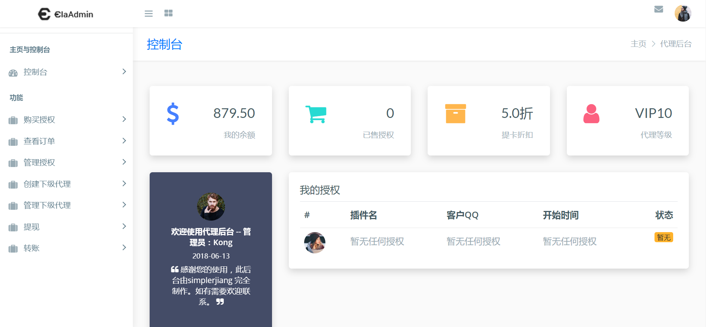
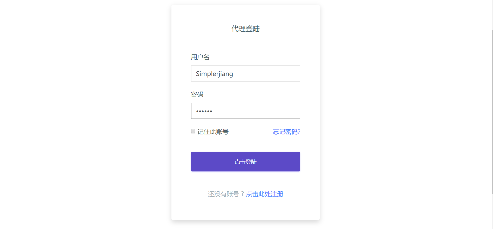
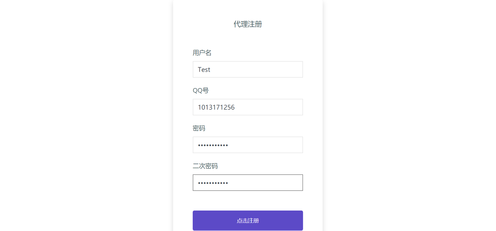
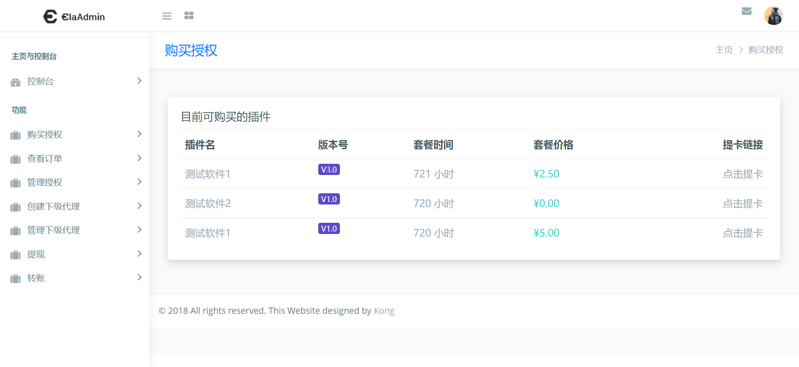
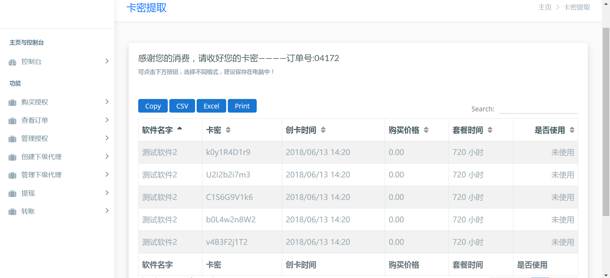
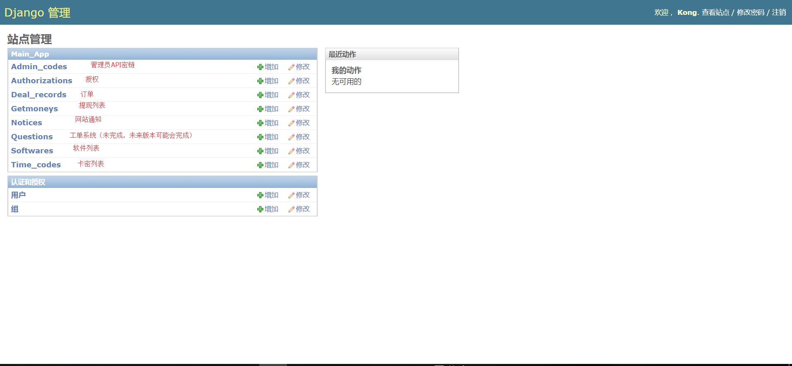

# proxy_code_system

一个历史版本的 **Python / Django 业务型 Web 项目**，围绕 **软件授权、自动发卡、多级代理、余额结算与后台运营** 展开。

这个仓库保留的是较早期的实现版本。虽然技术栈已经偏旧，但它仍然能代表我做过的完整业务系统实践，而不只是单点功能 Demo。

## 项目定位

这个项目尝试把几类常见的数字产品销售与授权流程整合到同一个系统中：

- 软件授权验证
- 自动生成与发放卡密
- 多级代理账户体系
- 代理余额、转账与提现申请
- 管理后台与公告系统
- 对外 API 接口与基础加密方案

从仓库结构来看，它不是一个单页示例，而是包含：

- Django 项目配置
- 业务模型
- Web 页面模板
- 静态资源
- API 文档
- 数据库文件
- 日志目录

的完整 Web 工程。

## 技术栈

- Python 3.6.x
- Django 1.8.3
- SQLite（仓库内默认示例数据库）
- 可迁移到 MySQL 等数据库
- HTML / CSS 模板页面

> 注意：这是一个历史代码库，不建议直接用现代 Python / Django 版本无修改上线生产。

## 核心能力

### 1. 软件授权系统

- 支持授权创建、授权查询、续费与机器人绑定变更
- 支持试用授权逻辑
- 提供授权查询 API

### 2. 自动发卡系统

- 软件与套餐信息可配置
- 卡密自动生成
- 支持代理提卡、卡密使用状态记录

### 3. 多级代理体系

- 代理等级与折扣体系
- 支持开设下级代理账号
- 支持上下级关系与收益流转场景

### 4. 余额与资金流转

- 代理账户余额管理
- 管理员充值 / 清零
- 上级向下级转账
- 提现申请记录

### 5. 后台与运营能力

- Django Admin 管理后台
- 公告系统
- 交易记录与操作留痕

### 6. API 能力

仓库内保留了较完整的 API 文档，涵盖：

- 管理员 API
- 代理账户 API
- 软件与价格接口
- 授权与卡密相关接口

详细见：[`README_api.md`](README_api.md)

## 业务模型概览

从 `main_app/models.py` 可以看到项目已经定义了较完整的业务模型，包括：

- `Others_info`：代理扩展信息、余额、广告、等级、TOKEN
- `Software`：软件与套餐配置
- `Authorization`：授权记录
- `Time_code`：卡密与使用状态
- `Deal_record`：交易流水
- `Getmoney`：提现申请
- `Notice`：公告
- `Question`：工单 / 问题记录

这也是我保留这个仓库的重要原因之一：它反映的是一个真实业务系统的数据建模过程。

## 项目结构

```text
main_app/          核心业务逻辑、模型、视图与后台配置
proxy_people_web/  Django 项目配置、路由与 settings
templates/         页面模板
static/            静态资源
README_api.md      API 说明
README_img/        页面截图
manage.py          Django 项目入口
requirements.txt   Python 依赖
```

## 页面截图

### 代理账户后台首页



### 登录页



### 注册页



### 购买卡密页



### 提卡页面



### 管理后台页面



## 运行说明

这是一个历史 Django 项目，推荐按“保守兼容”的方式运行：

1. 准备 Python 3.6.x 环境
2. 安装依赖：`requirements.txt`
3. 根据需要调整 `settings.py`
4. 使用 SQLite 示例数据库，或迁移到 MySQL 后再运行
5. 执行 Django 常规启动流程

如果你只是想阅读代码和业务流程，不一定需要真的把它跑起来；它更大的价值在于：

- 业务结构完整
- 模型定义明确
- 页面与 API 都有保留
- 能体现早期完整项目经验

## 当前状态

这个仓库当前主要用于：

- 保留历史实现
- 展示业务系统经验
- 整理文档与项目说明

它不是我当前主推的技术栈项目，但它仍然是我公开仓库里有代表性的 **Python / Django 业务系统**。

## Related

- 精简版相关项目：[`proxy_people_web_H`](https://github.com/simplerjiang/proxy_people_web_H)
- API 文档：[`README_api.md`](README_api.md)

## 为什么我保留这个仓库

虽然它已经是旧技术栈，但它能说明几件事：

- 我做过完整的业务型 Web 系统
- 我处理过授权、卡密、代理、后台、交易记录等多角色流程
- 我不只是写过工具类库，也做过带业务规则和数据模型的系统

从求职展示的角度看，它更适合作为 **历史代表项目** 存在。